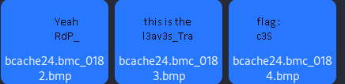

# Challenge Rootme 6

Lien : https://www.root-me.org/fr/Challenges/Forensic/Entretien-a-l-ANSSI

### Objectif :

**Trouver le flag dans le fichier pour l'ANSSI**

    unzip ch16.zip 
<b>

    sudo xmount --in ewf image_forensic.e01 /mnt
<b>

    sudo tar -xvf /mnt/image_forensic.dd -C ./
<b>

    git clone https://github.com/ANSSI-FR/bmc-tools
<b>

    mkdir bcache
<b>

    python3 ./bmc-tools/bmc-tools.py -s bcache24.bmc -d /home/joey/bcache
<b>

    ls ./bcache

J'ai ouvert le dossier *bcache* graphiquement et j'ai trouvé cela :

Le flag est donc **RdP_l3av3s_Trac3S** !
