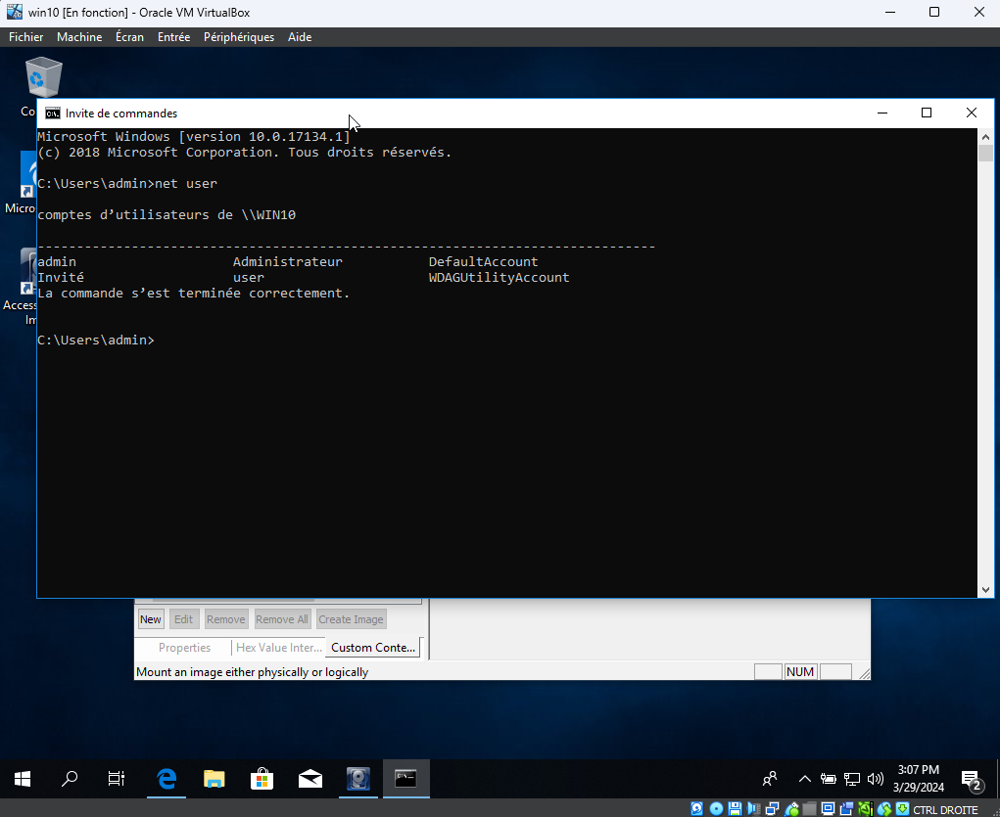

# Compte Rendu - Image mémoire 

### Objectif : trouver les mots de passe des utilisateurs 

J'ai dumpé la mémoire de ma VM qui a un utilisateur *admin* avec mot de passe *adminadmin*.

Utilisation de volatility pour afficher les hashs qui correspondent aux mots de passes des utilistaurs : 

    cd volatility3
<b>

    ./vol.py -f ../image_memoire/memdump.mem windows.hashdump.Hashdump

Output :

    Volatility 3 Framework 2.7.0
    Progress:  100.00  PDB scanning finished                                                                                              
    User rid lmhash nthash

    Administrateur  500 aad3b435b51404eeaad3b435b51404ee    3e126da93e034356d4e8cc3e0dd24357

Le hash qui nous interresse est le **3e126da93e034356d4e8cc3e0dd24357** !

Ensuite il faut cracker le hash :

    echo "3e126da93e034356d4e8cc3e0dd24357" > hash

    john hash --format=NT -w=/usr/share/wordlists/rockyou.txt

Output :

    Using default input encoding: UTF-8
    Loaded 1 password hash (NT [MD4 128/128 SSE2 4x3])
    Warning: no OpenMP support for this hash type, consider --fork=3
    Press 'q' or Ctrl-C to abort, almost any other key for status
    adminadmin       (?)     
    1g 0:00:00:00 DONE (2024-03-30 12:20) 10.00g/s 3677Kp/s 3677Kc/s 3677KC/s afshin..adidas99
    Use the "--show --format=NT" options to display all of the cracked passwords reliably
    Session completed. 

Nous retrouvons bien le mot de passe **adminadmin** !

