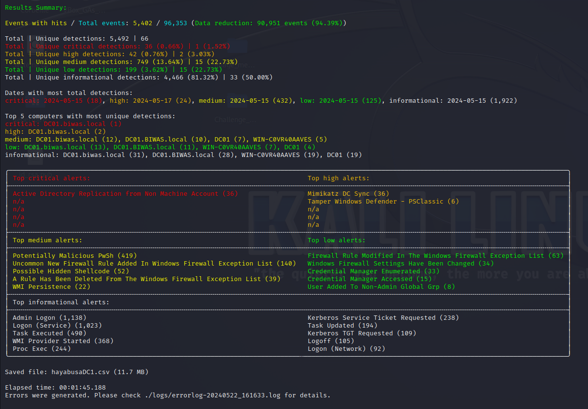
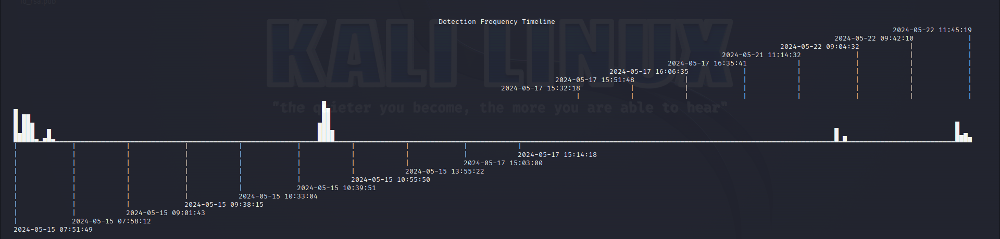

# Rapport de Main Courante d'analyse

*Premier challenge : Trouver la date et l'heure de l'incident*

Après avoir mis en place le LAB 2 SNS et donc monté les deux VM *DC* et *SRV*, j'ai pu commencer mon travail de forensic.
Pour me faciliter la tâche j'ai décidé de créé un fichier partagé entre les deux VM du LAB mon PC et une VM Kali Linux.

 

Premièrement j'ai installé dans le dossier partagé, nommé *VM_share*, **DFIR-ORC** qui est un outil de collecte de donnés de l'ANSSI.  

## Installation et utilisation de DFIR-ORC

Tout d'abord, j'ai téléchargé et copié dans le dossier partagé les deux release de DFIR-ORC le x64 et x86 sur *https://github.com/DFIR-ORC/dfir-orc/releases*.  

Ensuite, j'ai téléchargé le dépot git et fini l'installation.  

En Powershell:

    git clone "https://github.com/dfir-orc/dfir-orc-config.git"
    cd dfir-orc-config
    Copy-Item ../DFIR-Orc_x86.exe ./tools
    Copy-Item ../DFIR-Orc_x64.exe ./tools
    
J'ai du installer et copier les paquets suivant dans le dossier *./tools* :  
    
    tcpvcon.exe - listdlls.exe - psservice.exe - handle.exe - winpmem.exe - dumpit.exe
    
Puis, j'ai executé : 

    ./Command.cmd

Et dans le dossier *./output* il y aura un fichier *DFIR-Orc.exe* que j'ai executé. J'obtient finalement cela les données de la VM *DC* dans laquelle jai executé le fichier.

 

## Installation Hayabusa sur linux

Premierement, j'ai cloner le dépot Github d'Hayabusa :

    git clone https://github.com/Yamato-Security/hayabusa.git --recursive

Puis j'ai téléchargé le binaire sur moodle que Mr Poushoulon nous avez fournis au Semestre 5.

    mv Téléchargements/hayabusa hayabusa/
    cd hayabusa
    chmod +x hayabusa

## Utilisation Hayabusa

Prérequis : *avoir des fichiers en .evtx pour nourir hayabusa*

J'ai donc décompresser le dossier **./output/DFIR-ORC_DomainController_DC01.biwas.local_General.7z** puis dans celui-ci le dossier **./Event.7z/** et j'obtien dedans le dossier **evtx**.

Dans ce dossier les fichiers de log sont au format evtx mais leur extensions est .data j'ai donc en modifié les extensions des fichiers de log qui finissaient en .data pour les remplacer en .evtx

    for file in *.data; do mv "$file" "${file%.data}.evtx";done

Je peux maintenant lancer Hayabusa  avec les fichiers de log en .evtx.

    ./hayabusa  csv-timeline -T -d /mnt/dfir-orc-config/output/DC/DFIR-ORC_DomainController_DC01.biwas.local_General/evtx/ -o hayabusaDC.csv

Suite à la commande précédente j'obtient  un fichier *hayabusaDC.csv* ainsi que toutes les informations interprétée des Logs et Une TimeLine avec des évenements de sécurité démarrant le **15 mai à 7h51**.

Résulats de Hayabusa sur les logs du DC par Dfir-Orc : 

TimeLine : 

## Interprétation des résultats de Hayabusa 

